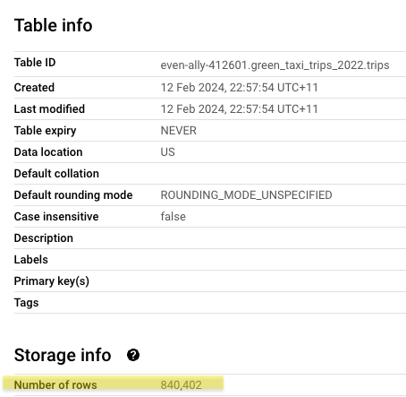
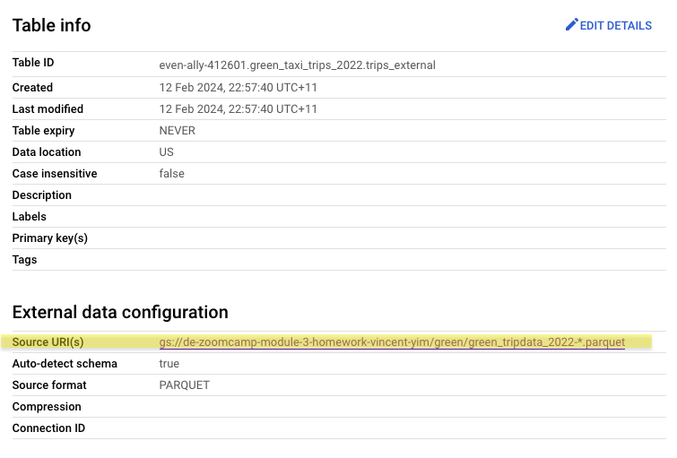

## Week 3 Homework
ATTENTION: At the end of the submission form, you will be required to include a link to your GitHub repository or other public code-hosting site. This repository should contain your code for solving the homework. If your solution includes code that is not in file format (such as SQL queries or shell commands), please include these directly in the README file of your repository.

<b><u>Important Note:</b></u> 
 For this homework we will be using the 2022 Green Taxi Trip Record Parquet Files from the New York
City Taxi Data found here:   https://www.nyc.gov/site/tlc/about/tlc-trip-record-data.page  
If you are using orchestration such as Mage, Airflow or Prefect do not load the data into Big Query using the orchestrator. 
Stop with loading the files into a bucket.   
<u>NOTE:</u> You will need to use the PARQUET option files when creating an External Table 

<b>SETUP:</b> 
Create an external table using the Green Taxi Trip Records Data for 2022.  
Create a table in BQ using the Green Taxi Trip Records for 2022 (do not partition or cluster this table).  

### 🔵 Answer

    
Show / hide

I had trouble getting Mage to load the Parquet files into GCS, so I modified the script provided by DE Zoomcamp and [used it](https://github.com/cenviity/data-engineering-zoomcamp-2024/blob/homework-module-3/03-data-warehouse/web_to_gcs.py) to accomplish the file loading instead.

The external table was then created with [this DDL statement](https://github.com/cenviity/data-engineering-zoomcamp-2024/blob/homework-module-3/03-data-warehouse/bigquery_queries.sql#L1-L6). The materialised table was created with [this DDL statement](https://github.com/cenviity/data-engineering-zoomcamp-2024/blob/homework-module-3/03-data-warehouse/bigquery_queries.sql#L8-L12).

## Question 1:
Question 1: What is count of records for the 2022 Green Taxi Data??
- 65,623,481
- 840,402
- 1,936,423
- 253,647

### 🔵 Answer

    
Show / hide

The answer is **840,402**. See [this SQL query](https://github.com/cenviity/data-engineering-zoomcamp-2024/blob/homework-module-3/03-data-warehouse/bigquery_queries.sql#L14-L19). The number of rows can also be seen in the BigQuery table metadata:

## Question 2:
Write a query to count the distinct number of PULocationIDs for the entire dataset on both the tables. 
What is the estimated amount of data that will be read when this query is executed on the External Table and the Table?

- 0 MB for the External Table and 6.41MB for the Materialized Table
- 18.82 MB for the External Table and 47.60 MB for the Materialized Table
- 0 MB for the External Table and 0MB for the Materialized Table
- 2.14 MB for the External Table and 0MB for the Materialized Table

### 🔵 Answer

    
Show / hide

The answer is **0 MB for the External Table and 6.41MB for the Materialized Table**. See [these two SQL queries](https://github.com/cenviity/data-engineering-zoomcamp-2024/blob/homework-module-3/03-data-warehouse/bigquery_queries.sql#L21-L28).

## Question 3:
How many records have a fare_amount of 0?
- 12,488
- 128,219
- 112
- 1,622

### 🔵 Answer

    
Show / hide

The answer is **1,622**. See [this SQL query](https://github.com/cenviity/data-engineering-zoomcamp-2024/blob/homework-module-3/03-data-warehouse/bigquery_queries.sql#L30-L36).

## Question 4:
What is the best strategy to make an optimized table in Big Query if your query will always order the results by PUlocationID and filter based on lpep_pickup_datetime? (Create a new table with this strategy)
- Cluster on lpep_pickup_datetime Partition by PUlocationID
- Partition by lpep_pickup_datetime  Cluster on PUlocationID
- Partition by lpep_pickup_datetime and Partition by PUlocationID
- Cluster on by lpep_pickup_datetime and Cluster on PUlocationID

### 🔵 Answer

    
Show / hide

The answer is **Partition by lpep_pickup_datetime and Cluster on PUlocationID**. See [this DDL SQL statement](https://github.com/cenviity/data-engineering-zoomcamp-2024/blob/homework-module-3/03-data-warehouse/bigquery_queries.sql#L38-L44). Partitioning the data means we only need to inspect the particular partitions containing the values filtered for `lpep_pickup_datetime` rather than the entire table every time. Clustering the data means records with the same `PULocationID` will already be adjacent to each other, speeding up queries that require the data to be sorted.

## Question 5:
Write a query to retrieve the distinct PULocationID between lpep_pickup_datetime
06/01/2022 and 06/30/2022 (inclusive) 

Use the materialized table you created earlier in your from clause and note the estimated bytes. Now change the table in the from clause to the partitioned table you created for question 4 and note the estimated bytes processed. What are these values?  

Choose the answer which most closely matches. 

- 22.82 MB for non-partitioned table and 647.87 MB for the partitioned table
- 12.82 MB for non-partitioned table and 1.12 MB for the partitioned table
- 5.63 MB for non-partitioned table and 0 MB for the partitioned table
- 10.31 MB for non-partitioned table and 10.31 MB for the partitioned table

### 🔵 Answer

    
Show / hide

The answer is **12.82 MB for non-partitioned table and 1.12 MB for the partitioned table**. See [these two SQL queries](https://github.com/cenviity/data-engineering-zoomcamp-2024/blob/homework-module-3/03-data-warehouse/bigquery_queries.sql#L46-L55).

## Question 6:
Where is the data stored in the External Table you created?

- Big Query
- GCP Bucket
- Big Table
- Container Registry

### 🔵 Answer

    
Show / hide

The answer is **GCP Bucket**. This is where we loaded the Parquet files to – also described in the BigQuery table metadata:

## Question 7:
It is best practice in Big Query to always cluster your data:
- True
- False

### 🔵 Answer

    
Show / hide

The answer is **False**. As mentioned in the [slides for this module](https://docs.google.com/presentation/d/1a3ZoBAXFk8-EhUsd7rAZd-5p_HpltkzSeujjRGB2TAI/edit#slide=id.g10c8bcef47f_0_9), with smaller datasets (fewer than 1 GB), clustering may not be an effective optimisation.

## (Bonus: Not worth points) Question 8:
No Points: Write a `SELECT count(*)` query FROM the materialized table you created. How many bytes does it estimate will be read? Why?

### 🔵 Answer

    
Show / hide

The answer is **0 B**. See [this SQL query](https://github.com/cenviity/data-engineering-zoomcamp-2024/blob/homework-module-3/03-data-warehouse/bigquery_queries.sql#L57-L60), which is identical to the one for Q1, so the results of the query have been cached and the query does not need to be rerun this time to return the same results.

## Submitting the solutions

* Form for submitting: https://courses.datatalks.club/de-zoomcamp-2024/homework/hw3
