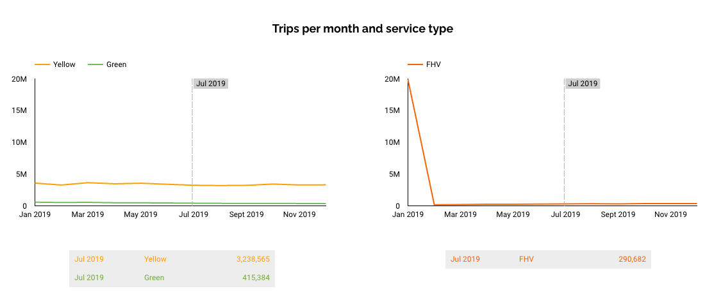

## Module 4 Homework

In this homework, we'll use the models developed during the week 4 videos and enhance the already presented dbt project using the already loaded Taxi data for fhv vehicles for year 2019 in our DWH.

This means that in this homework we use the following data [Datasets list](https://github.com/DataTalksClub/nyc-tlc-data/)
* Yellow taxi data - Years 2019 and 2020
* Green taxi data - Years 2019 and 2020
* fhv data - Year 2019.

We will use the data loaded for:

* Building a source table: `stg_fhv_tripdata`
* Building a fact table: `fact_fhv_trips`
* Create a dashboard

If you don't have access to GCP, you can do this locally using the ingested data from your Postgres database
instead. If you have access to GCP, you don't need to do it for local Postgres - only if you want to.

> **Note**: if your answer doesn't match exactly, select the closest option

### 🔵 Answer

    
Show / hide

#### Set up GCS infrastructure with Terraform

I wrote the Terraform files [main.tf](main.tf) and [variables.tf](variables.tf) to set up a BigQuery dataset where I would load the taxi trips data later.

#### Extract and load data using `dlt`

Then I used `dlt` to load the required Parquet files from the [nyc.gov](https://www.nyc.gov/site/tlc/about/tlc-trip-record-data.page) page into BigQuery (see files in the [`ny_taxi_trips`](https://github.com/cenviity/data-engineering-zoomcamp-2024/tree/d942b6fd61427f1abf80889f7147942e09e7612a/cohorts/2024/04-analytics-engineering/ny_taxi_trips) folder). It took me many attempts to get the `dlt` pipeline to do what I wanted, but I learnt a lot in the process. Currently, loading all three datasets (one for each category of vehicles) takes around two hours. I'm sure it could be optimised to run even faster. I'll revisit this if I have time – some ideas include using an async IO library such as `httpx`.

One surprising challenge was that Pandas would automatically cast columns with both ints and nulls into floats, which wreaked havoc with some of the ID columns. I had to use a combination of `df.convert_dtypes()` and `dlt`'s import schemas to fix the column data types when loading data. I'm quite happy with what I've got so far.

#### Set up and configure dbt Cloud

I prefer working in VS Code, so I decided to set up the dbt Cloud CLI instead of using the dbt Cloud IDE (which I've used at work before when I first picked up dbt). I also spent some time installing dbt Core and configuring the **[dbt Power User](https://marketplace.visualstudio.com/items?itemName=innoverio.vscode-dbt-power-user)** and **[Turntable](https://marketplace.visualstudio.com/items?itemName=turntable.turntable-for-dbt-core)** VS Code extensions combined with `sqlfluff` for linting and formatting Jinja SQL files.

### Question 1:

**What happens when we execute dbt build --vars '{'is_test_run':'true'}'**
You'll need to have completed the ["Build the first dbt models"](https://www.youtube.com/watch?v=UVI30Vxzd6c) video.
- It's the same as running *dbt build*
- It applies a _limit 100_ to all of our models
- It applies a _limit 100_ only to our staging models
- Nothing

### 🔵 Answer

    
Show / hide

Since the `is_test_run` variable is only used in the staging models ([`stg_green_taxi_trips`][green] and [`stg_yellow_taxi_trips`][yellow]), the answer is **It applies a _limit 100_ only to our staging models**.

[green]: dbt-taxi-rides-ny/models/staging/stg_green_taxi_trips.sql
[yellow]: dbt-taxi-rides-ny/models/staging/stg_yellow_taxi_trips.sql

### Question 2:

**What is the code that our CI job will run? Where is this code coming from?**

- The code that has been merged into the main branch
- The code that is behind the creation object on the dbt_cloud_pr_ schema
- The code from any development branch that has been opened based on main
- The code from the development branch we are requesting to merge to main

### 🔵 Answer

    
Show / hide

The CI job runs whenever a pull request is opened for merging changes into the `main` branch. The answer is **The code from the development branch we are requesting to merge to main**.

### Question 3 (2 points)

**What is the count of records in the model fact_fhv_trips after running all dependencies with the test run variable disabled (:false)?**
Create a staging model for the fhv data, similar to the ones made for yellow and green data. Add an additional filter for keeping only records with pickup time in year 2019.
Do not add a deduplication step. Run this models without limits (is_test_run: false).

Create a core model similar to fact trips, but selecting from stg_fhv_tripdata and joining with dim_zones.
Similar to what we've done in fact_trips, keep only records with known pickup and dropoff locations entries for pickup and dropoff locations.
Run the dbt model without limits (is_test_run: false).

- 12998722
- 22998722
- 32998722
- 42998722

### 🔵 Answer

    
Show / hide

I created a [staging model for the FHV data][fhv_staging] and a [core model][fhv_core] joining that data with `dim_zones`. There are 23,014,060 records in the `fact_fhv_trips` table after running all dependencies with the `is_test_run` variable disabled. The closest answer is **22,998,722**.

[fhv_staging]: dbt-taxi-rides-ny/models/staging/stg_fhv_taxi_trips.sql
[fhv_core]: dbt-taxi-rides-ny/models/core/fact_fhv_trips.sql

### Question 4 (2 points)

**What is the service that had the most rides during the month of July 2019 month with the biggest amount of rides after building a tile for the fact_fhv_trips table and the fact_trips tile as seen in the videos?**

Create a dashboard with some tiles that you find interesting to explore the data. One tile should show the amount of trips per month, as done in the videos for fact_trips, including the fact_fhv_trips data.

- FHV
- Green
- Yellow
- FHV and Green

### 🔵 Answer

    
Show / hide

I created a new page in the dashboard from module 4's course demo to compare trips per month and service type – see [here][looker]. The answer is **Yellow** with the most rides in July 2019, at 3,238,565.

[][looker]

[looker]: https://lookerstudio.google.com/s/pHHLIrSZ9vs

## Submitting the solutions

* Form for submitting: https://courses.datatalks.club/de-zoomcamp-2024/homework/hw4

Deadline: 22 February (Thursday), 22:00 CET

## Solution (To be published after deadline)

* Video: https://youtu.be/3OPggh5Rca8
* Answers:
  * Question 1: It applies a _limit 100_ only to our staging models
  * Question 2: The code from the development branch we are requesting to merge to main
  * Question 3: 22998722
  * Question 4: Yellow
